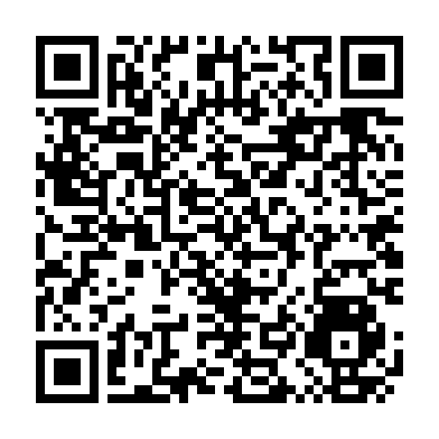
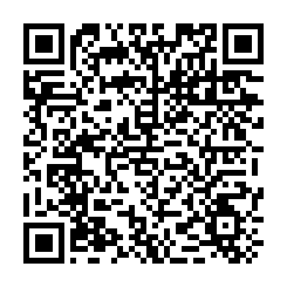
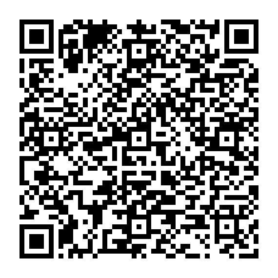

# iOS 自动更新与捷径设置

推荐使用 Shadowrocket 自带的模块自动后台更新。捷径提供方便的手动导入入口，不能代替后台更新设置。

## 添加现成捷径，无需自己搭建

**[下载完整的 AdBlock_lok 更新入口捷径](https://github.com/lok347/shadowrocket-adblock/raw/refs/heads/main/shortcuts/AdBlock-lok-update.shortcut)**

<a href="https://github.com/lok347/shadowrocket-adblock/raw/refs/heads/main/shortcuts/AdBlock-lok-update.shortcut"></a>

1. 在 iPhone Safari 中打开下载链接，或扫码下载。
2. 点开下载的 `.shortcut` 文件；如果浏览器只保存文件，在「文件 → 下载」中打开它。
3. 在快捷指令的导入界面按「添加快捷指令」。无需修改 URL，也无需自行添加动作。

捷径已预填本仓库固定链接，只有一项执行动作：打开 Shadowrocket 的远程模块安装/导入入口。首次运行可能询问是否允许打开 Shadowrocket，模块导入也可能需要确认。完整文件已经过公开的 HubSign 服务签名；动作源文件保留在 [`shortcuts/AdBlock-lok-update.plist`](../shortcuts/AdBlock-lok-update.plist)，便于检查。

本链接分发的是已签名文件，不是 iCloud 分享链接。目前尚未做 iPhone 实机导入及运行测试。

## 固定订阅链接

[打开或复制固定链接](https://raw.githubusercontent.com/lok347/shadowrocket-adblock/main/Shadowrocket-AdBlock.sgmodule)



```text
https://raw.githubusercontent.com/lok347/shadowrocket-adblock/main/Shadowrocket-AdBlock.sgmodule
```

仓库发布新版本时，会将此文件与最新的 `Shadowrocket-AdBlock-lok.YYYYMMDD.sgmodule` 同步。日期文件用于留档，固定链接用于持续订阅。

## 设置自动更新

1. 打开 Shadowrocket，进入「配置 → 模块 → ＋」，填入固定链接，下载并启用。
2. 进入「设置 → 更新 → 模块」，开启「自动后台更新」，建议间隔为 1 天，可按需要开启更新提醒。
3. 在 iOS「设置 → 通用 → 后台 App 刷新」中允许 Shadowrocket 后台刷新。

若之前安装的是日期文件或本地副本，请改用上面的远程固定链接。若应用中没有模块自动更新设置，请先升级 Shadowrocket；开发者在 2.2.76 的更新说明中已加入此功能。

后台执行时间由 iOS 安排，不保证精确到点。手机重启或应用被手动结束后，重新打开一次 Shadowrocket，让应用恢复后台任务。

## 手动创建快捷指令（备用）

1. 打开 iOS「快捷指令」，新建快捷指令并命名为「AdBlock_lok 更新入口」。
2. 添加「URL」动作，粘贴下面完整地址。
3. 添加「打开 URL」动作，使用上一步的 URL。
4. 保存。需要时可以将这个快捷指令添加到主屏幕。

```text
shadowrocket://install?module=https%3A%2F%2Fraw.githubusercontent.com%2Flok347%2Fshadowrocket-adblock%2Fmain%2FShadowrocket-AdBlock.sgmodule
```



此二维码包含同一个 `shadowrocket://` 地址。扫码工具需要支持打开该 Scheme；若无法识别，直接复制地址到快捷指令的「URL」动作。

这个入口会打开 Shadowrocket 安装/导入远程模块，可能显示确认界面。它不是经过实机验证的静默覆盖命令，也不是 iCloud 快捷指令下载链接。设置好模块自动后台更新后，无需再用定时快捷指令反复导入。

`shadowrocket://update-subs` 更新的是服务器节点订阅，不用于更新本仓库的广告过滤模块。

## 确认版本

更新后检查模块名称中的日期，例如 `AdBlock_lok.20261007`，并与仓库 README 的「当前稳定版本」对照。日期已一致，表示已取得本期文件；广告过滤规则是否适合你的应用，仍需实际使用观察。

本说明根据公开文档整理，尚未在维护者的 iPhone 上验证捷径导入与后台执行。

## 资料来源

- [Shadowrocket 开发者更新频道：模块自动更新](https://t.me/s/ShadowrocketNews?after=1267)
- [LOWERTOP 社区使用手册：自动更新](https://github.com/LOWERTOP/Shadowrocket#自动更新)
- [LOWERTOP 社区使用手册：模块](https://github.com/LOWERTOP/Shadowrocket#模块)
- [LOWERTOP 社区使用手册：URL Schemes](https://github.com/LOWERTOP/Shadowrocket#url-schemes)
- [Apple：共享快捷指令（iCloud 或文件）](https://support.apple.com/guide/shortcuts/share-shortcuts-apdf01f8c054/ios)
- [Cherri：使用 RoutineHub HubSign 签名](https://cherrilang.org/compiler/signing.html)
